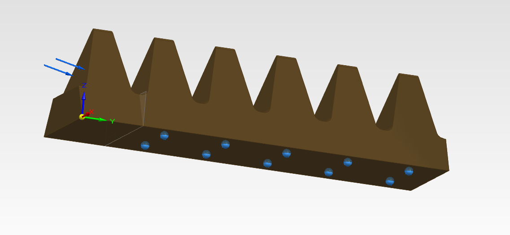
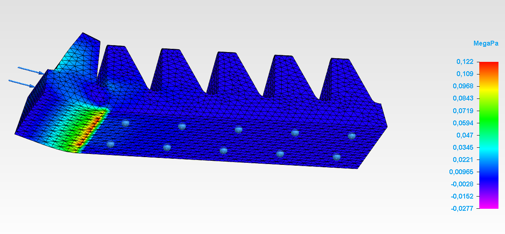

# Chocolate Series 🍫

It's a weird coincidence, but I keep finding myself working on chocolate-related projects! I guess it's the universe trying to tell me that chocolate is the best way to get people excited about science 😎
Below, some ideas:

## Measuring Light Velocity with Chocolate  
In this experiment, I measured the speed of light using chocolate! You can watch a detailed explanation in this [video](https://www.youtube.com/watch?v=IrcOSE6kXLQ).  

---

## Printing a DVD Grating onto Chocolate  
Using the **TPC_Nano_4** (PDF: [TPC_Nano_4.pdf](./TPC_Nano_4.pdf)), I printed a DVD grating onto a piece of chocolate, creating a rainbow diffraction effect. Here's how I achieved it:

1. **Preparation**: Carefully etched the DVD grating into a melted chocolate.  
2. **Experiment Setup**: Used a laser to diffract light through the chocolate, showcasing the resulting patterns.  

    
    

### Outcome  
This process beautifully demonstrated the diffraction phenomenon, adding a creative twist to scientific experiments.

---

## My BSc Final Work  

### Solid Edge Simulations  
Simulations are stored in the folder **"Simulações"**.  

    
    

### Presentation  
You can view my full presentation [here](https://ulisboa-my.sharepoint.com/:p:/g/personal/ist1100290_tecnico_ulisboa_pt/EQ4V218uO5ZGqtCjz-5W49IB5_f_3tdDB6PNVQpSwy_xLw?e=tpis7j).
